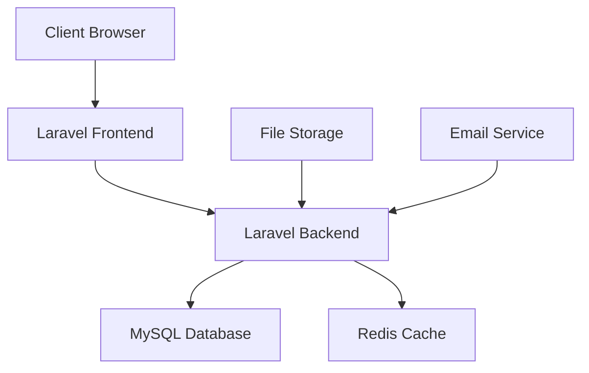

# Cahier des Charges Technique - Système de Gestion Scolaire IFRAN

## 1. Présentation
**Nom du projet** : IFRAN School Management System  
**Date** : 2024  
**Développeurs** : [ABOYA CYRIL]  
**Adresse Github** : [À compléter]

## 2. Analyse Client
Le projet IFRAN est un système de gestion scolaire complet qui répond aux besoins suivants :
- Gestion des emplois du temps pour différentes classes
- Suivi des présences et absences des étudiants
- Gestion des utilisateurs avec différents rôles (étudiants, enseignants, coordinateurs, parents)
- Système de notifications pour les absences et événements importants
- Génération de statistiques et rapports

## 3. Choix Technologiques

### Frontend
- **Framework** : Laravel  + Bootstrap 5
- **JavaScript** : Vanilla JS + jQuery
- **CSS** : Custom CSS + Bootstrap
- **Bibliothèques** : 
  - Chart.js pour les graphiques
  - Font Awesome pour les icônes
  - Particles.js pour les animations

**Motivation** : 
- Intégration native avec Laravel
- Performance optimale
- Facilité de maintenance
- Compatibilité navigateurs

### Backend
- **Framework** : Laravel 10
- **Base de données** : MySQL
- **Cache** : Redis
- **Serveur** : Apache/Nginx

**Motivation** :
- Framework PHP mature et sécurisé
- ORM Eloquent puissant
- Système de migration robuste
- Excellente documentation

## 4. Architecture Technique



## 5. Stratégie de Sécurité

### Authentification
- Sessions chiffrées
- Protection CSRF sur tous les formulaires
- Middleware d'authentification

### Architecture Public/Privé
- Routes protégées par middleware auth
- Vérification des rôles pour chaque action

### Mots de passe
- Hashage bcrypt


### Base de données
- SQLite
- MySQL pour la production

### Frontend
- Protection XSS
- Headers de sécurité
- CSP configuré

## 6. Déploiement

```bash
# Prérequis
PHP >= 8.1
Composer
Node.js >= 16
MySQL >= 8.0

# Installation
git clone [repository]
cd [project]
composer install
npm install
cp .env.example .env
php artisan key:generate
php artisan migrate
php artisan db:seed
npm run build

# Configuration
- Configurer .env
- Configurer le virtual host
- Configurer les permissions storage/
```

## 7. Méthode de Travail
- Méthodologie Agile/Scrum
- Sprints de 2 semaines
- Code review systématique


## 8. Outils Utilisés
- **IDE** : VS Code, 
- **Versioning** : Git, GitHub
- **CI/CD** : GitHub Actions
- **Tests** : Environnement de test local
- **Documentation** : PHPDoc

## 9. Évaluation du Temps de Travail

| Tâche | Jours |
|-------|--------|
| Setup initial | 2 |
| Auth system | 3 |
| User Management | 5 |
| Timetable System | 7 |
| Attendance System | 5 |
| Statistics | 4 |
| Testing | 3 |
| Documentation | 2 |
| **Total** | **31** |

## 10. Liste Fonctionnelle

### Système d'authentification
- [x] Login multi-rôles
- [x] Gestion des sessions
- [x] Récupération mot de passe

### Gestion des utilisateurs
- [x] CRUD utilisateurs
- [x] Attribution des rôles
- [x] Gestion des profils

### Emploi du temps
- [x] Création/modification des emplois du temps
- [x] Vue par classe/enseignant
- [x] Historique des modifications

### Gestion des présences
- [x] Marquage des présences
- [x] Justification des absences
- [x] Notifications automatiques

### Statistiques
- [x] Taux de présence
- [x] Rapports par classe
- [x] Graphiques d'analyse

## 11. Recettage

| Fonctionnalité | Statut | Notes |
|----------------|--------|--------|
| Login | ✅ | Opérationnel |
| Création utilisateur | ✅ | Opérationnel |
| Emploi du temps | ✅ | Opérationnel |
| Présences | ✅ | Opérationnel |
| Notifications | ✅ | Opérationnel |
| Statistiques | ✅ | Opérationnel |
| Export données | ❌ |  PDF/Excel |
| API Mobile | ❌ | Non développé | # Cahier des Charges Technique - Système de Gestion Scolaire IFRAN

## 1. Présentation
**Nom du projet** : IFRAN School Management System  
**Date** : 2024  
**Développeurs** : [ABOYA CYRIL]  
**Adresse Github** : [À compléter]

## 2. Analyse Client
Le projet IFRAN est un système de gestion scolaire complet qui répond aux besoins suivants :
- Gestion des emplois du temps pour différentes classes
- Suivi des présences et absences des étudiants
- Gestion des utilisateurs avec différents rôles (étudiants, enseignants, coordinateurs, parents)
- Système de notifications pour les absences et événements importants
- Génération de statistiques et rapports

## 3. Choix Technologiques

### Frontend
- **Framework** : Laravel  + Bootstrap 5
- **JavaScript** : Vanilla JS + jQuery
- **CSS** : Custom CSS + Bootstrap
- **Bibliothèques** : 
  - Chart.js pour les graphiques
  - Font Awesome pour les icônes
  - Particles.js pour les animations

**Motivation** : 
- Intégration native avec Laravel
- Performance optimale
- Facilité de maintenance
- Compatibilité navigateurs

### Backend
- **Framework** : Laravel 10
- **Base de données** : MySQL
- **Cache** : Redis
- **Serveur** : Apache/Nginx

**Motivation** :
- Framework PHP mature et sécurisé
- ORM Eloquent puissant
- Système de migration robuste
- Excellente documentation

## 4. Architecture Technique


## 5. Stratégie de Sécurité

### Authentification
- Sessions chiffrées
- Protection CSRF sur tous les formulaires
- Middleware d'authentification

### Architecture Public/Privé
- Routes protégées par middleware auth
- Vérification des rôles pour chaque action

### Mots de passe
- Hashage bcrypt


### Base de données
- SQLite
- MySQL pour la production

### Frontend
- Protection XSS
- Headers de sécurité
- CSP configuré

## 6. Déploiement

```bash
# Prérequis
PHP >= 8.1
Composer
Node.js >= 16
MySQL >= 8.0

# Installation
git clone [repository]
cd [project]
composer install
npm install
cp .env.example .env
php artisan key:generate
php artisan migrate
php artisan db:seed
npm run build

# Configuration
- Configurer .env
- Configurer le virtual host
- Configurer les permissions storage/
```

## 7. Méthode de Travail
- Méthodologie Agile/Scrum
- Sprints de 2 semaines
- Code review systématique


## 8. Outils Utilisés
- **IDE** : VS Code, 
- **Versioning** : Git, GitHub
- **CI/CD** : GitHub Actions
- **Tests** : Environnement de test local
- **Documentation** : PHPDoc

## 9. Évaluation du Temps de Travail

| Tâche | Jours |
|-------|--------|
| Setup initial | 2 |
| Auth system | 3 |
| User Management | 5 |
| Timetable System | 7 |
| Attendance System | 5 |
| Statistics | 4 |
| Testing | 3 |
| Documentation | 2 |
| **Total** | **31** |

## 10. Liste Fonctionnelle

### Système d'authentification
- [x] Login multi-rôles
- [x] Gestion des sessions
- [x] Récupération mot de passe

### Gestion des utilisateurs
- [x] CRUD utilisateurs
- [x] Attribution des rôles
- [x] Gestion des profils

### Emploi du temps
- [x] Création/modification des emplois du temps
- [x] Vue par classe/enseignant
- [x] Historique des modifications

### Gestion des présences
- [x] Marquage des présences
- [x] Justification des absences
- [x] Notifications automatiques

### Statistiques
- [x] Taux de présence
- [x] Rapports par classe
- [x] Graphiques d'analyse

## 11. Recettage

| Fonctionnalité | Statut | Notes |
|----------------|--------|--------|
| Login | ✅ | Opérationnel |
| Création utilisateur | ✅ | Opérationnel |
| Emploi du temps | ✅ | Opérationnel |
| Présences | ✅ | Opérationnel |
| Notifications | ✅ | Opérationnel |
| Statistiques | ✅ | Opérationnel |
| Export données | ❌ |  PDF/Excel |
| API Mobile | ❌ | Non développé | 

<p align="center"><a href="https://laravel.com" target="_blank"></a></p>

<p align="center">
<a href="https://github.com/laravel/framework/actions"></a>
<a href="https://packagist.org/packages/laravel/framework"></a>
<a href="https://packagist.org/packages/laravel/framework"></a>
<a href="https://packagist.org/packages/laravel/framework"></a>
</p>

## About Laravel

Laravel is a web application framework with expressive, elegant syntax. We believe development must be an enjoyable and creative experience to be truly fulfilling. Laravel takes the pain out of development by easing common tasks used in many web projects, such as:

- [Simple, fast routing engine](https://laravel.com/docs/routing).
- [Powerful dependency injection container](https://laravel.com/docs/container).
- Multiple back-ends for [session](https://laravel.com/docs/session) and [cache](https://laravel.com/docs/cache) storage.
- Expressive, intuitive [database ORM](https://laravel.com/docs/eloquent).
- Database agnostic [schema migrations](https://laravel.com/docs/migrations).
- [Robust background job processing](https://laravel.com/docs/queues).
- [Real-time event broadcasting](https://laravel.com/docs/broadcasting).

Laravel is accessible, powerful, and provides tools required for large, robust applications.

## Learning Laravel

Laravel has the most extensive and thorough [documentation](https://laravel.com/docs) and video tutorial library of all modern web application frameworks, making it a breeze to get started with the framework.

You may also try the [Laravel Bootcamp](https://bootcamp.laravel.com), where you will be guided through building a modern Laravel application from scratch.

If you don't feel like reading, [Laracasts](https://laracasts.com) can help. Laracasts contains thousands of video tutorials on a range of topics including Laravel, modern PHP, unit testing, and JavaScript. Boost your skills by digging into our comprehensive video library.

## Laravel Sponsors

We would like to extend our thanks to the following sponsors for funding Laravel development. If you are interested in becoming a sponsor, please visit the [Laravel Partners program](https://partners.laravel.com).

### Premium Partners

- **[Vehikl](https://vehikl.com/)**
- **[Tighten Co.](https://tighten.co)**
- **[WebReinvent](https://webreinvent.com/)**
- **[Kirschbaum Development Group](https://kirschbaumdevelopment.com)**
- **[64 Robots](https://64robots.com)**
- **[Curotec](https://www.curotec.com/services/technologies/laravel/)**
- **[Cyber-Duck](https://cyber-duck.co.uk)**
- **[DevSquad](https://devsquad.com/hire-laravel-developers)**
- **[Jump24](https://jump24.co.uk)**
- **[Redberry](https://redberry.international/laravel/)**
- **[Active Logic](https://activelogic.com)**
- **[byte5](https://byte5.de)**
- **[OP.GG](https://op.gg)**

## Contributing

Thank you for considering contributing to the Laravel framework! The contribution guide can be found in the [Laravel documentation](https://laravel.com/docs/contributions).

## Code of Conduct

In order to ensure that the Laravel community is welcoming to all, please review and abide by the [Code of Conduct](https://laravel.com/docs/contributions#code-of-conduct).

## Security Vulnerabilities

If you discover a security vulnerability within Laravel, please send an e-mail to Taylor Otwell via [taylor@laravel.com](mailto:taylor@laravel.com). All security vulnerabilities will be promptly addressed.

## License

The Laravel framework is open-sourced software licensed under the [MIT license](https://opensource.org/licenses/MIT).
