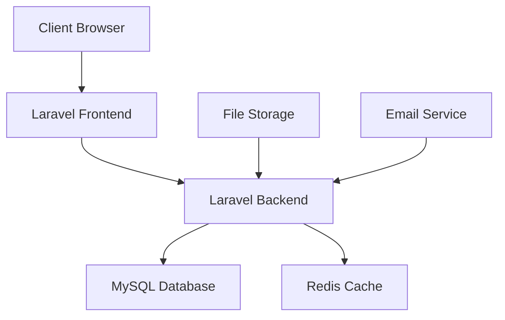

# Cahier des Charges Technique - Système de Gestion Scolaire IFRAN

## 1. Présentation
**Nom du projet** : IFRAN School Management System  
**Date** : 2024  
**Développeurs** : [ABOYA CYRIL]  
**Adresse Github** : [À compléter]

## 2. Analyse Client
Le projet IFRAN est un système de gestion scolaire complet qui répond aux besoins suivants :
- Gestion des emplois du temps pour différentes classes
- Suivi des présences et absences des étudiants
- Gestion des utilisateurs avec différents rôles (étudiants, enseignants, coordinateurs, parents)
- Système de notifications pour les absences et événements importants
- Génération de statistiques et rapports

## 3. Choix Technologiques

### Frontend
- **Framework** : Laravel  + Bootstrap 5
- **JavaScript** : Vanilla JS + jQuery
- **CSS** : Custom CSS + Bootstrap
- **Bibliothèques** : 
  - Chart.js pour les graphiques
  - Font Awesome pour les icônes
  - Particles.js pour les animations

**Motivation** : 
- Intégration native avec Laravel
- Performance optimale
- Facilité de maintenance
- Compatibilité navigateurs

### Backend
- **Framework** : Laravel 10
- **Base de données** : MySQL
- **Cache** : Redis
- **Serveur** : Apache/Nginx

**Motivation** :
- Framework PHP mature et sécurisé
- ORM Eloquent puissant
- Système de migration robuste
- Excellente documentation

## 4. Architecture Technique



## 5. Stratégie de Sécurité

### Authentification
- Sessions chiffrées
- Protection CSRF sur tous les formulaires
- Middleware d'authentification

### Architecture Public/Privé
- Routes protégées par middleware auth
- Vérification des rôles pour chaque action

### Mots de passe
- Hashage bcrypt


### Base de données
- SQLite
- MySQL pour la production

### Frontend
- Protection XSS
- Headers de sécurité
- CSP configuré

## 6. Déploiement

```bash
# Prérequis
PHP >= 8.1
Composer
Node.js >= 16
MySQL >= 8.0

# Installation
git clone [repository]
cd [project]
composer install
npm install
cp .env.example .env
php artisan key:generate
php artisan migrate
php artisan db:seed
npm run build

# Configuration
- Configurer .env
- Configurer le virtual host
- Configurer les permissions storage/
```

## 7. Méthode de Travail
- Méthodologie Agile/Scrum
- Sprints de 2 semaines
- Code review systématique


## 8. Outils Utilisés
- **IDE** : VS Code, 
- **Versioning** : Git, GitHub
- **CI/CD** : GitHub Actions
- **Tests** : Environnement de test local
- **Documentation** : PHPDoc

## 9. Évaluation du Temps de Travail

| Tâche | Jours |
|-------|--------|
| Setup initial | 2 |
| Auth system | 3 |
| User Management | 5 |
| Timetable System | 7 |
| Attendance System | 5 |
| Statistics | 4 |
| Testing | 3 |
| Documentation | 2 |
| **Total** | **31** |

## 10. Liste Fonctionnelle

### Système d'authentification
- [x] Login multi-rôles
- [x] Gestion des sessions
- [x] Récupération mot de passe

### Gestion des utilisateurs
- [x] CRUD utilisateurs
- [x] Attribution des rôles
- [x] Gestion des profils

### Emploi du temps
- [x] Création/modification des emplois du temps
- [x] Vue par classe/enseignant
- [x] Historique des modifications

### Gestion des présences
- [x] Marquage des présences
- [x] Justification des absences
- [x] Notifications automatiques

### Statistiques
- [x] Taux de présence
- [x] Rapports par classe
- [x] Graphiques d'analyse

## 11. Recettage

| Fonctionnalité | Statut | Notes |
|----------------|--------|--------|
| Login | ✅ | Opérationnel |
| Création utilisateur | ✅ | Opérationnel |
| Emploi du temps | ✅ | Opérationnel |
| Présences | ✅ | Opérationnel |
| Notifications | ✅ | Opérationnel |
| Statistiques | ✅ | Opérationnel |
| Export données | ❌ |  PDF/Excel |
| API Mobile | ❌ | Non développé | 